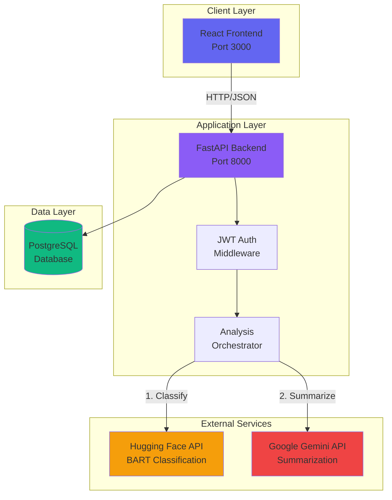
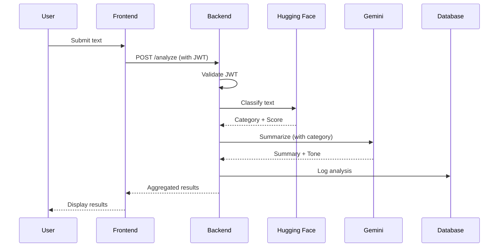
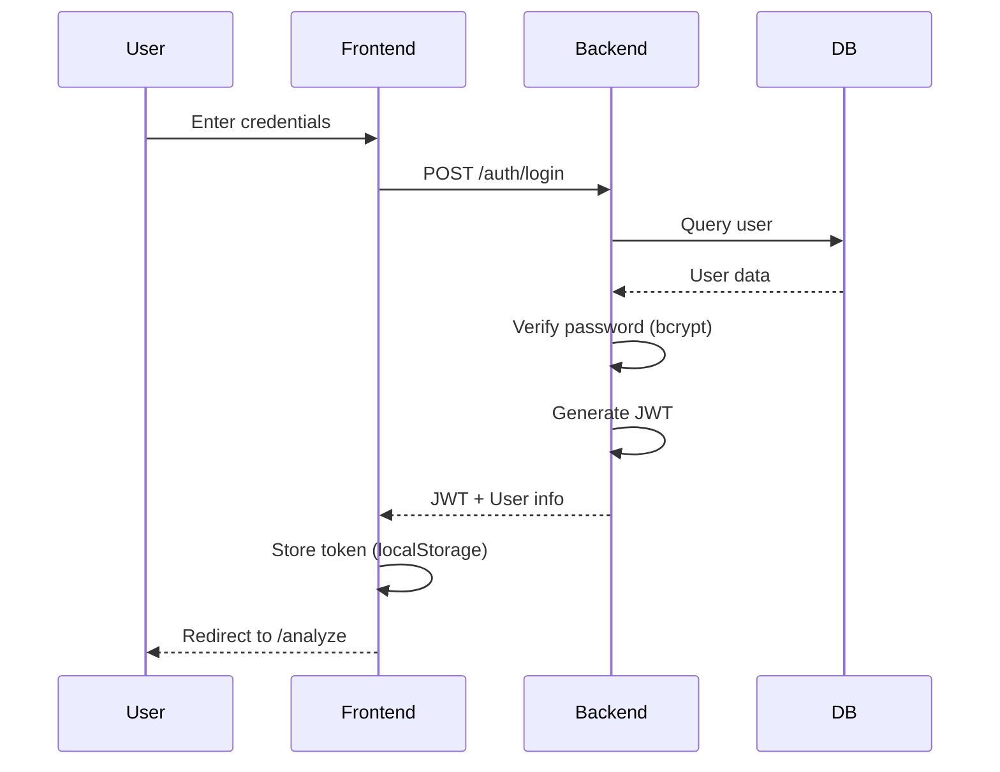

# System Architecture

## Overview

Hybrid-Analyzer is a three-tier architecture application that combines multiple AI services to provide comprehensive text analysis.

## Architecture Diagram



## Data Flow

### Analysis Workflow



### Authentication Flow



## Component Details

### Backend (FastAPI)

**Technology Stack:**
- FastAPI 0.104+
- SQLAlchemy 2.0+ (ORM)
- PostgreSQL driver (psycopg2)
- Pydantic (validation)
- Python-JOSE (JWT)
- Passlib + Bcrypt (password hashing)

**Modules:**

1. **Authentication (`auth/`)**
   - User registration and login
   - JWT token generation and validation
   - Password hashing with bcrypt
   - Protected route middleware

2. **Analysis (`analysis/`)**
   - Hugging Face integration
   - Gemini API integration
   - Orchestration logic
   - Result aggregation

3. **Database (`database.py`)**
   - SQLAlchemy engine configuration
   - Session management
   - Connection pooling

### Frontend (React)

**Technology Stack:**
- React 18
- React Router 6
- Axios (HTTP client)
- Vite (build tool)

**Structure:**

1. **Pages**
   - `AuthPage`: Login/Register with toggle
   - `AnalyzePage`: Text analysis interface

2. **Components**
   - `LoginForm`: Login form with validation
   - `RegisterForm`: Registration with password confirmation
   - `AnalysisForm`: Text input with custom labels
   - `ResultsDisplay`: Visual results presentation
   - `LoadingSpinner`: Loading state
   - `ErrorMessage`: Error display

3. **Services**
   - `api.js`: Axios instance with interceptors
   - `auth.js`: Authentication API calls
   - `analysis.js`: Analysis API calls

4. **Utilities**
   - `tokenManager.js`: JWT localStorage management
   - `useAuth.js`: Authentication state hook

### Database (PostgreSQL)

**Schema:**

1. **users**
   - Primary key: `id`
   - Unique constraints: `username`, `email`
   - Indexed fields: `username`, `email`

2. **analysis_logs**
   - Foreign key: `user_id` → `users.id`
   - Indexed fields: `user_id`, `created_at`
   - Stores analysis history

## Security Architecture

### Authentication

- **Password Storage**: Bcrypt hashing with salt
- **Token Type**: JWT (JSON Web Tokens)
- **Token Expiration**: 24 hours (configurable)
- **Token Storage**: Client-side localStorage
- **Protected Routes**: Middleware validation

### API Security

- **CORS**: Configured allowed origins
- **Input Validation**: Pydantic schemas
- **SQL Injection**: Prevented by SQLAlchemy ORM
- **Rate Limiting**: Dependent on external APIs

### Network Security

- **HTTPS**: Recommended for production
- **Environment Variables**: Sensitive data isolation
- **Docker Secrets**: For production deployments

## Error Handling

### Backend

1. **HTTP Exceptions**
   - 400: Bad Request (validation errors)
   - 401: Unauthorized (invalid JWT)
   - 500: Internal Server Error (service failures)

2. **Service Errors**
   - Timeout handling (30s default)
   - Network error recovery
   - Fallback mechanisms (Gemini tone detection)

### Frontend

1. **API Errors**
   - Axios interceptors for 401 (auto-logout)
   - User-friendly error messages
   - Error state management

2. **Validation**
   - Client-side form validation
   - Character limits
   - Required fields

## Performance Considerations

### Backend

- **Async Operations**: FastAPI async/await
- **Connection Pooling**: SQLAlchemy pool
- **Timeout Configuration**: Configurable API timeouts

### Frontend

- **Code Splitting**: Vite automatic splitting
- **Lazy Loading**: React Router lazy imports
- **Caching**: Nginx static asset caching

### Database

- **Indexes**: On frequently queried fields
- **Connection Pooling**: Managed by SQLAlchemy
- **Query Optimization**: ORM-based queries

## Scalability

### Horizontal Scaling

- **Backend**: Stateless design (JWT)
- **Database**: PostgreSQL replication
- **Load Balancing**: Nginx or cloud LB

### Vertical Scaling

- **Database**: Increase resources
- **Backend**: Increase worker processes
- **Caching**: Redis for session/results

## Monitoring & Logging

### Backend Logging

- **Framework**: Loguru
- **Levels**: INFO, DEBUG, ERROR
- **Outputs**: Console + file rotation
- **Format**: Structured JSON logs

### Metrics

- **API Response Times**: Track analysis duration
- **Error Rates**: Monitor service failures
- **Database Queries**: Track slow queries

## Deployment Architecture

### Docker Compose (Development)

```
┌─────────────────┐
│   Frontend      │ :3000
│   (Nginx)       │
└────────┬────────┘
         │
┌────────▼────────┐
│   Backend       │ :8000
│   (FastAPI)     │
└────────┬────────┘
         │
┌────────▼────────┐
│   PostgreSQL    │ :5432
└─────────────────┘
```

### Production (Kubernetes)

```
┌──────────────┐
│ Load Balancer│
└──────┬───────┘
       │
   ┌───▼────┐
   │ Ingress│
   └───┬────┘
       │
   ┌───▼────────────┐
   │ Frontend Pods  │
   │ (Nginx)        │
   └───┬────────────┘
       │
   ┌───▼────────────┐
   │ Backend Pods   │
   │ (FastAPI)      │
   └───┬────────────┘
       │
   ┌───▼────────────┐
   │ PostgreSQL     │
   │ (StatefulSet)  │
   └────────────────┘
```

## API Rate Limits

### Hugging Face

- **Free Tier**: ~30,000 characters/month
- **Inference API**: May have model loading delays
- **Recommendation**: Implement caching

### Google Gemini

- **Free Tier**: 60 requests/minute
- **Quota**: Check current limits
- **Recommendation**: Implement rate limiting

## Future Enhancements

1. **Caching Layer**: Redis for repeated analyses
2. **Queue System**: Celery for async processing
3. **Batch Processing**: Analyze multiple texts
4. **Analytics Dashboard**: User statistics
5. **Export Features**: PDF/CSV results export
6. **Multi-language**: i18n support
7. **Real-time Updates**: WebSocket notifications
